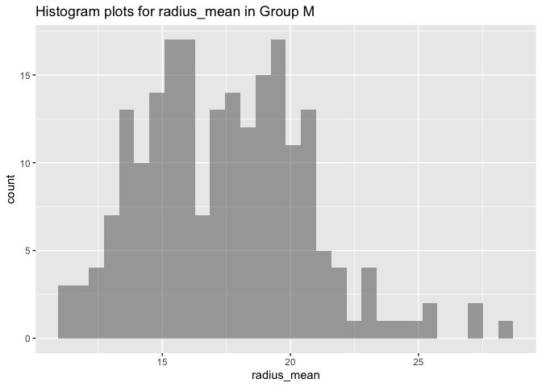
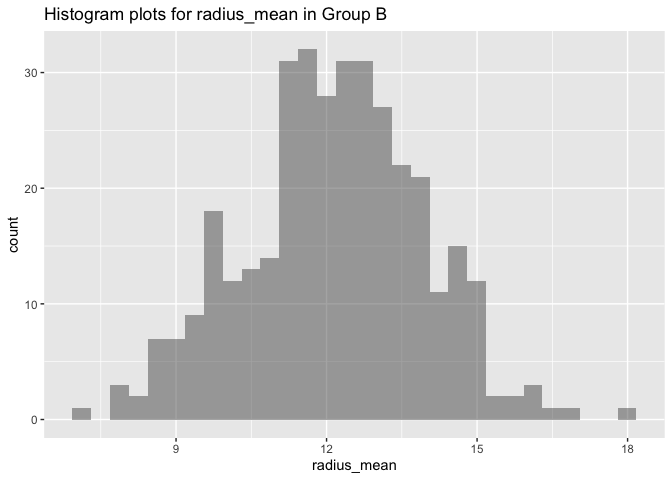
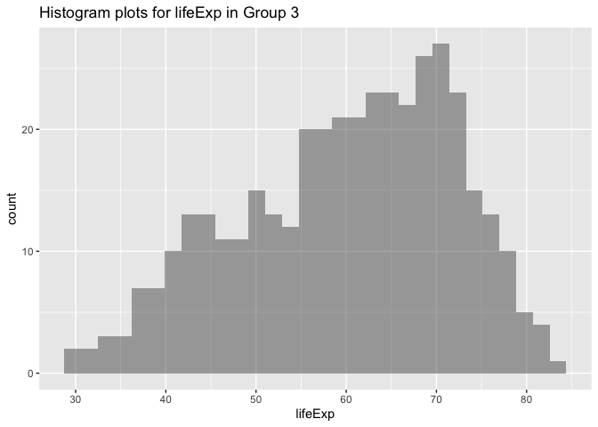
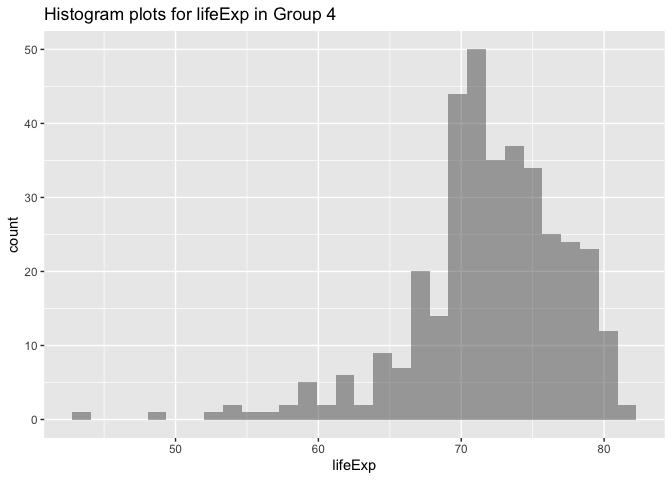
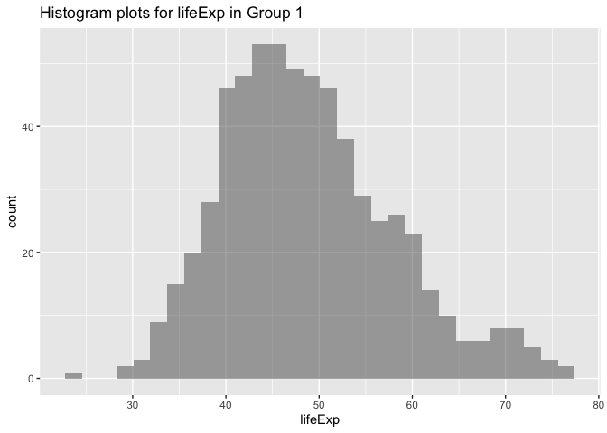
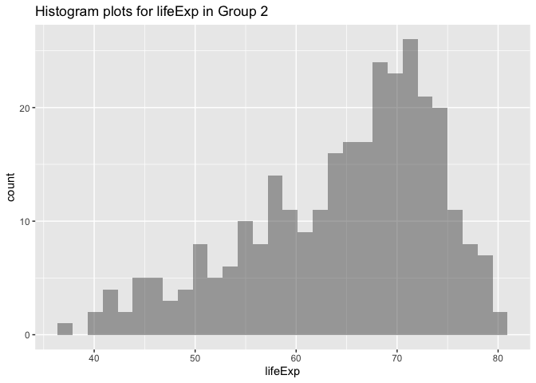
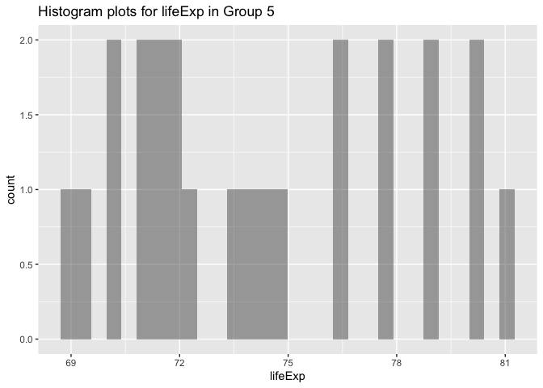

<!-- README.md is generated from README.Rmd. Please edit that file -->

# histogramplot

<!-- badges: start -->

<!-- badges: end -->

This package is used for data visualization, especially when there is a
group variable in a dataset. It contains the function histogram\_plot
that can make histogram plots for a certain variable in different groups
or levels in the dataset seperately.

## Installation

You can install the released version of histogramplot from
[CRAN](https://CRAN.R-project.org) with:

``` r
install.packages("histogramplot")
```

And the development version from [GitHub](https://github.com/) with:

``` r
# install.packages("devtools")
devtools::install_github("graceyin06/545B-package")
```

### Required packages for apply the function histogram\_plot in histogramplot package

  - magrittr
  - dplyr
  - tidyverse

## Example

There are two examples showing how to use this package to make seperate
histogram plots.

``` r
#load the required packages
suppressMessages(library(dplyr))
suppressMessages(library(magrittr))
suppressMessages(library(datateachr))
suppressMessages(library(tidyverse))
```

### Example 1

Make the histogram plots for radius\_mean in two diagnosis groups.

``` r
#load the dataset
library(gapminder)
#load the histogramplot package
library(histogramplot)
## basic example code
# make two histogram plots for radius_mean in two diagnosis groups.
histogram_plot(cancer_sample,diagnosis,radius_mean,"radius_mean")
#> [[1]]
```



    #> 
    #> [[2]]



### Example 2

Make the histogram plots for lifeExp in five continents in gapminder
datset .

``` r
### make the histogram plots for lifeExp in five continents.
histogram_plot(gapminder,continent,lifeExp,"lifeExp")
#> [[1]]
```



    #> 
    #> [[2]]



    #> 
    #> [[3]]



    #> 
    #> [[4]]



    #> 
    #> [[5]]


